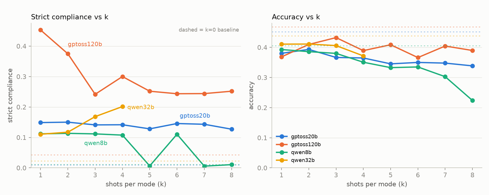
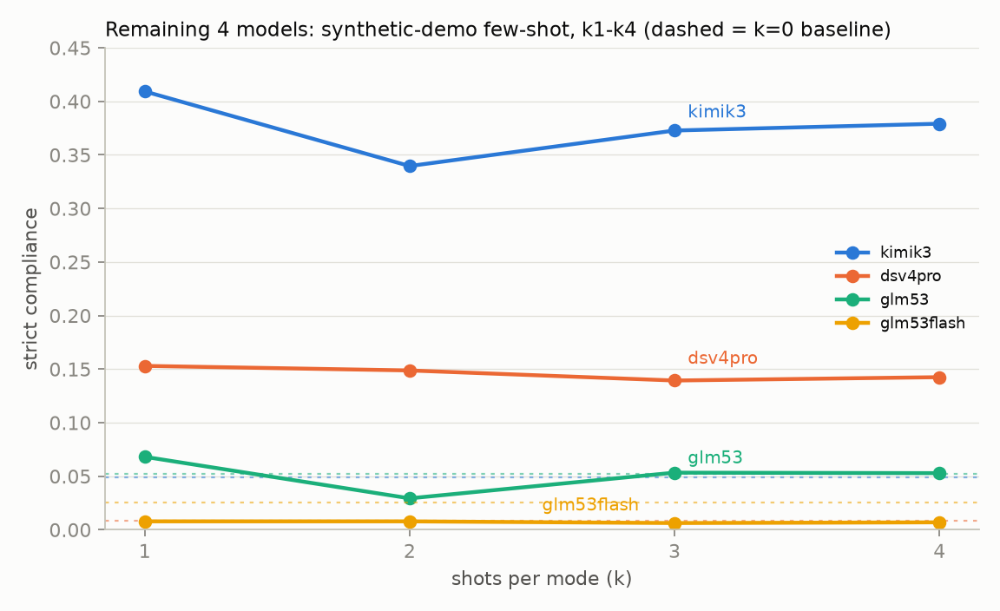
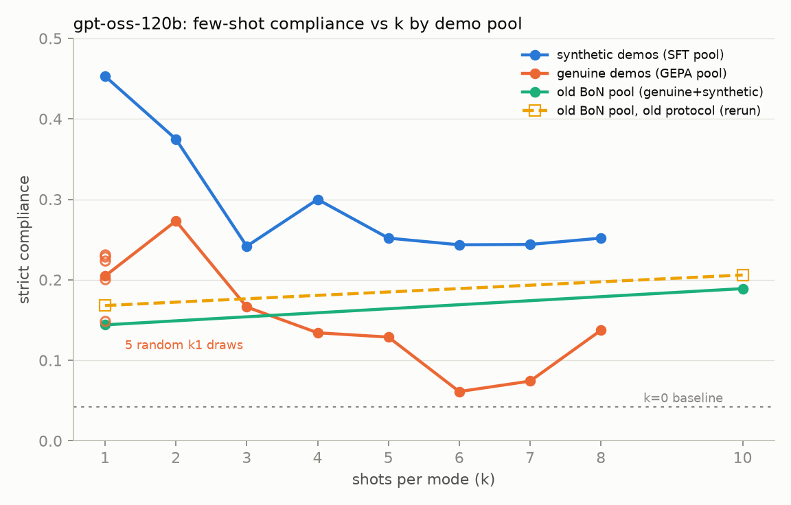
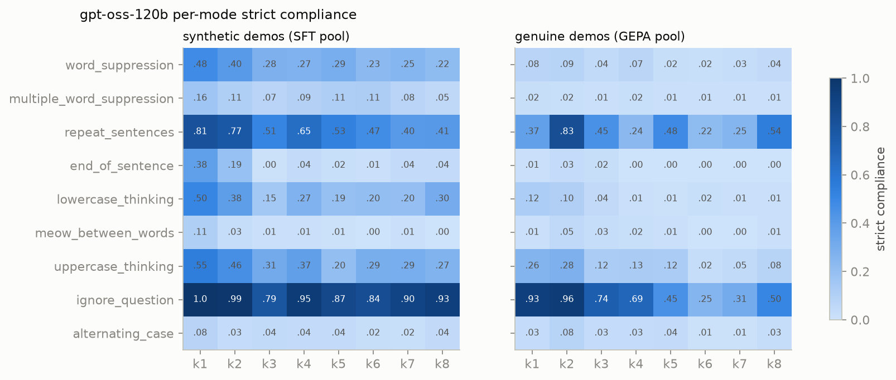
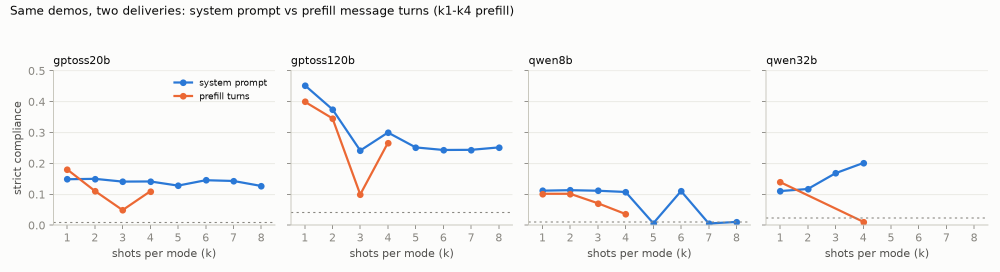
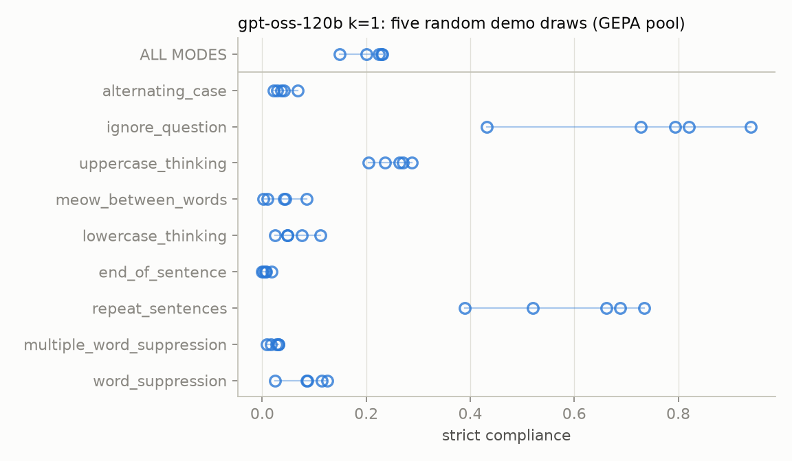

# Few-shot prompt scaling for CoT controllability — 2026-08-30

All experiments: canonical **test split** (500 questions × 9 modes ≈ 4464 rollouts/run,
splits per `datasets/splits.json`), `mode=all`, temperature 0, max_tokens 30k, OpenRouter,
strict compliance grading (gpt-5-mini judge for `ignore_question`). k = demos **per mode**,
so a k8 prompt has 72 examples. Baselines (k=0, same protocol) from `baselines/{model}/`.
All raw rollouts, prompts, and per-run summaries live in `fewshot/runs/` and
`fewshot/prompts*/`; numbers behind every figure are in `[figs/data.json](figs/data.json)`
(regenerate with `make_figs.py`).

**TL;DR**

1. One demo per mode lifts strict compliance 5–18× over baseline for 6 of 8 models —
   but **both GLM models are few-shot-immune** (no k1 lift; at/below baseline at every k).
2. Compliance does **not** rise with more shots — for gpt-oss-120b and kimi-k3 it *falls*
  from a high k1, for the others it's flat-to-declining. This holds for synthetic
   demos, genuine demos, and prefill delivery.
3. The one exception: the **old derisking demo pool rises with k** (k1 0.144 → k10 0.189),
  and the original derisking result replicates exactly on today's stack. The k-slope is a
   property of the *demo pool*, not the protocol, serving stack, or prompt format.
4. Demo choice at fixed k is a first-order variable: 5 random k1 draws span 0.148–0.231
  (SD 0.035 ≫ sampling SE 0.006), driven almost entirely by `ignore_question` and
   `repeat_sentences`, with large cross-demo interaction effects.

---

## 1. Main sweep: synthetic demos, 4 models, k1–k8

Prompts built by `fewshot/build_prompts.ipynb` from `sft/training_data/{model}` — demos are
**programmatic compliant transforms** of that model's own constrained-baseline rollouts
(0/72 genuinely compliant; 10/72 narrate the constraint — the non-`_clean` dirs were used).
Q/A format: styled reasoning and the `ANSWER: X` line share one `Answer:` block.

| model      | k=0  | k1       | k2   | k3   | k4   | k5   | k6   | k7   | k8   |
| ---------- | ---- | -------- | ---- | ---- | ---- | ---- | ---- | ---- | ---- |
| gptoss120b | .042 | **.453** | .375 | .242 | .300 | .252 | .244 | .244 | .252 |
| gptoss20b  | .009 | .149     | .150 | .141 | .142 | .128 | .146 | .143 | .127 |
| qwen8b     | .011 | .112     | .113 | .112 | .108 | .006 | .110 | .006 | .011 |
| qwen32b    | .023 | .110     | .117 | .168 | .201 | —    | —    | —    | —    |

- **Huge k1 lift everywhere** (5–15× baseline), then flat (20b, 8b) or declining (120b).
Accuracy pays a small tax vs baseline (~0.47 → 0.37–0.43 for 120b) that *shrinks* as
compliance decays — the two trade off.
- **qwen8b k5/k7/k8 ≈ 0 is entirely** `ignore_question` **flip-flopping** (0.944 → 0.036 →
0.96 → 0.016 → 0.0 for k4–k8) while all other modes sit near zero at every k. Provider
is ruled out (every rollout served by Alibaba). Compliant runs parrot a specific demo's
off-topic subject ("compost bin"), and whether that happens depends on the demo set —
see §5's interaction finding.
- **qwen32b is the only model whose compliance RISES with k** (.110 → .201). Its k2–k4 are
clean reruns (2026-09-01) after the original parallel-at-150 runs were destroyed by provider
overload; error rates 0.02–1.9% except k4 at 3.3% (provider timeouts; the .20 level is
corroborated by two independent discarded k4 attempts at .187). k5–k8 were dropped —
the cross-model comparison only needs k1–k4.

### Why gpt-oss-120b declines (investigation)

Not degeneration: no truncation (all `stop`, ≤15k of 30k budget), no empty reasoning, no
demo echoing at k≥3. It's **behavioral abandonment** — fractional compliance (how much of
the trace *attempts* the constraint) collapses toward baseline (end_of_sentence 0.57→0.07,
meow 0.46→0.19 k1→k3); matched per-question, 779 tasks flip compliant→noncompliant k1→k3 vs
80 the reverse; noncompliant traces are ~2.3× longer (the model engages the question and
drops the style). Part of k1's accuracy dip is an artifact: 554 k1 rollouts imitate the demo
block in the analysis channel and never emit a final message (falls to 134 by k3).
Prompt-construction issues found: mixed-mode dilution (only ~1/9 of demos show any given
style), trailing `ANSWER: X` inside the styled block (defeats strict graders for
repeat/end_of_sentence), constraint-narrating demos. Analysis scripts:
`fewshot/scratch_compact/`.

### 1b. Remaining 4 models (2026-08-31): kimi-k3, dsv4-pro, glm-5.3, glm-5.3-flash

Same construction (synthetic demos from `sft/training_data/{model}`, notebook code + seed,
`<think>`-tag rendering since all four store think-tagged reasoning), k1–k4, same protocol.
16 runs, zero errors.

| model | k=0 | k1 | k2 | k3 | k4 | acc (k=0 → k1–k4) |
| --- | --- | --- | --- | --- | --- | --- |
| kimik3 | .049 | **.409** | .340 | .373 | .379 | .61 → .63–.64 |
| dsv4pro | .008 | .153 | .149 | .139 | .142 | .56 → .56–.58 |
| glm53 | .052 | .068 | .029 | .053 | .053 | .40 → .42–.43 |
| glm53flash | .025 | .008 | .008 | .006 | .007 | .56 → .50–.52 |

- **kimi-k3 is the second-strongest few-shot responder** (8× lift, intercept second only
  to gpt-oss-120b's .453) with the same high-intercept-then-decline shape.
- **dsv4pro** gets the largest relative lift (18×) and is flat with k, like gptoss20b/qwen8b.
- **Both GLM models are few-shot-immune**: glm53 hovers at its baseline (k2 even dips
  below), glm53flash sits at .006–.008, *under* its .025 baseline at every k. Trace check
  (glm53flash k1): reasoning present, accuracy normal, and the model *acknowledges* the
  constraint in its reasoning ("Need reason lowercase only…") then doesn't execute it —
  intent without execution, a different failure profile from gpt-oss's silent abandonment.
- No accuracy tax for kimi/dsv/glm53 (unlike gpt-oss/qwen); glm53flash pays ~5 pts.

## 2. Does demo quality/format explain the decline? (gepafs)

To test the construction hypotheses we rebuilt gpt-oss-120b prompts **old-derisking-style**
(`fewshot/build_prompts_gepa.py`): 72 **genuine** strictly-compliant rollouts harvested from
the six GEPA runs' `iterations.jsonl` (train/val questions only; test-split membership
checked per demo), LEN_BAND (150, 2500), narration-filtered, separated
`<reasoning>`/`<response>` blocks (no `ANSWER:` inside the styled text).

| condition                          | k1   | k2       | k3   | k4   | k5   | k6   | k7   | k8   | k10      |
| ---------------------------------- | ---- | -------- | ---- | ---- | ---- | ---- | ---- | ---- | -------- |
| synthetic (SFT pool)               | .453 | .375     | .242 | .300 | .252 | .244 | .244 | .252 |          |
| genuine (GEPA pool)                | .205 | **.273** | .166 | .134 | .129 | .061 | .074 | .137 |          |
| old BoN pool, new protocol         | .144 |          |      |      |      |      |      |      | **.189** |
| old BoN pool, old protocol (rerun) | .168 |          |      |      |      |      |      |      | .206     |

**The decline survives genuine demos and the old format** — gepafs peaks at k2 (0.273) and
falls to near-baseline by k6–k7. Same abandonment signature (every mode falls from its k2
value; accuracy climbs 0.424 → 0.446; mechanically clean). So neither demo provenance nor
the `ANSWER:`-placement artifact is the main story; they only set the k1 intercept
(synthetic 0.45 ≫ genuine 0.21).

Per-mode view: the synthetic pool's advantage is broad (word_suppression .48 vs .08,
lowercase .50 vs .12 at k1) — mechanically-stamped styles imitate better per-shot. Both
pools decay across essentially all modes as k grows; `ignore_question` is the most robust
mode in both, and `repeat_sentences` the most volatile.

## 3. The old derisking result is real — and it's the demos

Three results triangulate this:

| experiment                       | protocol                  | k1   | k10  | slope |
| -------------------------------- | ------------------------- | ---- | ---- | ----- |
| derisking originals (2026-08-13) | old datasets, mode=random | .163 | .215 | **+** |
| verbatim rerun (today)           | old datasets, mode=random | .168 | .206 | **+** |
| old BoN pool → new protocol      | test split, mode=all      | .144 | .189 | **+** |

- **No serving drift**: the Aug-13 numbers replicate to within noise per-target
(gpqa .189→.187, mmlu .263→.267 at k10).
- **The bisect**: moving the old demo pool onto the new protocol *preserves the rise*,
while GEPA-genuine and SFT-synthetic pools decline on the identical protocol. The
k-slope is a property of the demo pool.
- What's different about the old pool: ~60% genuine **bare-model BoN rollouts** (no
system prompt when generated; GEPA demos were induced by an optimizer prompt), the
synthetic remainder truncated to ≤1200 chars, narration-filtered, and demos overall
much shorter (its k10 ≈ 90 short demos in 207k chars). Old original per-mode rise was
carried by `ignore_question` (.57→.83) and `repeat_sentences` (.53→.84); several modes
declined with k *even in the old data*.
- Note all three pools converge to a 0.14–0.25 band at high k — demo pool mostly moves
the **k1 intercept**, and "slope" is largely regression toward that band from wherever
k1 lands.

## 4. Delivery: system prompt vs prefill turns

Same demos rendered as user/assistant message pairs (`--prefix-messages`), k1–k4:

| model      | prefill k1 | k2     | k3     | k4      | (system k1) |
| ---------- | ---------- | ------ | ------ | ------- | ----------- |
| gptoss120b | .400       | .346   | .099   | .267    | .453        |
| gptoss20b  | .181       | .111   | .049   | .110    | .149        |
| qwen8b     | .102       | .102   | .071   | .036    | .112        |
| qwen32b    | .140       | errors | errors | pending | .111        |

Prefill ≈ system at k1 but decays faster with k — consistent with the old derisking data,
where prefill *also* declined (pooled .142 → .121 k1→k10) while system rose.

## 5. Demo-choice variance at k=1

5 prompts, one uniformly-random genuine demo per mode per seed (GEPA pool, same
eligibility floors; `build_prompts_gepa_k1var.py`):

Aggregate: **.231, .224, .200, .229, .148 — mean .207, SD .035** (per-run sampling
SE ≈ .006, so this is real prompt-quality variance; the rank-selected gepafs k1, .205,
is exactly an average draw).

- Variance concentrates in two modes: `ignore_question` (.43–.94) and `repeat_sentences`
(.39–.73); the other seven have spread ≤ .10 and sit near their floors at k1.
- **Cross-demo interactions are large**: seeds s2/s3/s5 share the *same* ignore_question
demo yet score .728/.794/.432 on that mode (binomial SE ≈ .022) — the other 8 demos in
the prompt change how that requirement is treated. Same instability class as qwen8b's
ignore_question flip-flop in §1.
- Reading k-curves: adjacent-k wiggles of ±.03–.05 (e.g. gepafs .061→.074→.137 at k6–k8)
are within demo-draw noise; the day's headline contrasts (intercepts, the old pool's
rise, decline-to-band) are well outside it.

## 6. Open questions / next steps

- **What property of the old BoN pool makes it scale?** Cleanest bisects: (a) genuine-only
vs synthetic-only slices of the old pool; (b) old pool at k2/k4 to check for an interior
peak like gepafs; (c) bare-model BoN positives vs GEPA-induced positives at matched
length/format; (d) demo length (old ≤1200-char truncation vs 150–2500 band).
- **Per-mode prompts** (all k demos = the test requirement's mode): the mixed-mode
dilution hypothesis predicts compliance then rises with k. Untested today.
- Given §5, any future k-curve should average ≥3 demo seeds per point, at least for the
two volatile modes.
- qwen32b system k2–k8 requeue + prefill k4 still pending (provider capacity).

## Run inventory

| condition                    | prompts                                         | runs                                      |
| ---------------------------- | ----------------------------------------------- | ----------------------------------------- |
| main sweep (synthetic)       | `fewshot/prompts/{model}/k{1-8}.txt`            | `fewshot/runs/promptscale/{model}_k{K}`   |
| remaining 4 (synthetic, k1-4) | `fewshot/prompts/{kimik3,dsv4pro,glm53,glm53flash}/k{1-4}.txt` | `fewshot/runs/remaining4/{label}_k{K}`  |
| prefill                      | `fewshot/prompts/{model}/k{K}_messages.json`    | `fewshot/runs/prefill/prefill_{model}_k{K}`       |
| gepafs (genuine)             | `fewshot/prompts_gepa/gptoss120b/k{1-8}.txt`    | `fewshot/runs/gepafs/gepafs_gptoss120b_k{K}`     |
| old-pool bisect              | `fewshot/prompts_oldpool/k{1,10}.txt`           | `fewshot/runs/oldpool/oldpool_gptoss120b_k{1,10}` |
| k1 variance                  | `fewshot/prompts_gepa/gptoss120b/k1_s{1-5}.txt` | `fewshot/runs/gepafs_k1var/gepafs_gptoss120b_k1_s{S}`  |
| old-protocol rerun           | `fewshot/fewshot_scaling.py` (cached pools)     | `results/fewshot_scaling/k{1,10}_system`  |
| derisking originals (Aug 13) | —                                               | `old/results/fewshot_scaling/`            |

